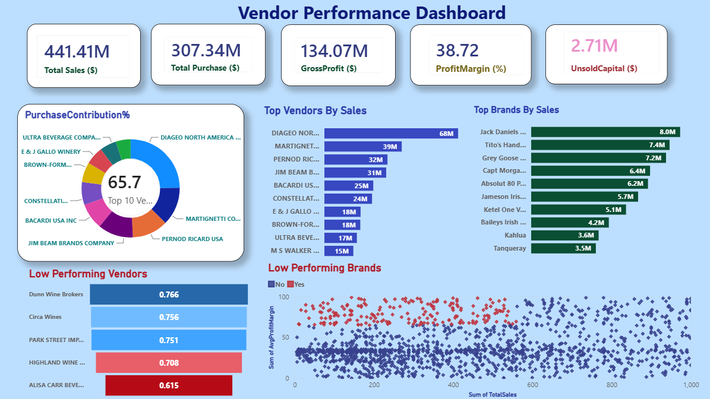

# 📊 Vendor Performance Analysis Dashboard

An end-to-end **Data Analytics & Business Intelligence** project that analyzes vendor performance using **Python, SQL, and Power BI**. The project focuses on vendor profitability, inventory optimization, procurement efficiency, and business insights through data analysis, statistical techniques, and an interactive dashboard.

---

## 🚀 Project Overview

This project helps businesses evaluate vendor performance by analyzing sales, purchases, and inventory data. The analysis identifies high-performing vendors, slow-moving inventory, procurement opportunities, and provides actionable recommendations through an interactive Power BI dashboard.

---

## 🎯 Business Problem

Businesses often face challenges such as:

- Identifying the best-performing vendors
- Reducing procurement costs
- Managing excess inventory
- Tracking vendor profitability
- Improving purchasing decisions
- Understanding vendor contribution to overall sales

This project addresses these challenges using data-driven analysis.

---

## 🛠️ Tech Stack

- **Python**
- **SQL (SQLite)**
- **Power BI**
- **Pandas**
- **NumPy**
- **Matplotlib**
- **Seaborn**
- **Jupyter Notebook**

---

# 📊 Power BI Dashboard

The interactive dashboard provides a complete overview of vendor performance with key business metrics.

### Dashboard Features

- 📈 Total Sales
- 💰 Total Profit
- 📦 Purchase Analysis
- 🏆 Top Performing Vendors
- 📉 Low Performing Vendors
- 📦 Inventory Turnover
- 💵 Unsold Inventory Value
- 📊 Profit Margin Analysis
- 🌍 Vendor-wise Performance
- 📅 Time-based Sales Analysis
- 🎯 Interactive Filters & Slicers

---

## 📷 Dashboard Preview



## 📂 Project Workflow

### 1️⃣ Data Collection
- Extracted data from SQLite Database
- Loaded purchase, sales, inventory, and vendor data

### 2️⃣ Data Cleaning
- Removed missing values
- Corrected inconsistent records
- Removed duplicate entries
- Prepared clean datasets

### 3️⃣ Exploratory Data Analysis (EDA)
- Sales Analysis
- Profit Analysis
- Vendor Analysis
- Correlation Analysis
- Inventory Analysis

### 4️⃣ Feature Engineering
Created business metrics including:

- Profit Margin
- Unsold Inventory Value
- Stock Turnover
- Vendor Contribution
- Unit Purchase Cost

### 5️⃣ Statistical Analysis
- Confidence Interval
- Hypothesis Testing
- Vendor Comparison

### 6️⃣ Dashboard Development
Designed an interactive Power BI dashboard to visualize KPIs and business insights.

---

# 📈 Key Insights

- Top vendors contribute the majority of revenue.
- Bulk purchasing reduces unit procurement cost.
- Some vendors have low inventory turnover, indicating excess stock.
- Significant capital is locked in unsold inventory.
- High-margin products with low sales present promotion opportunities.
- Statistical analysis confirms significant differences in vendor performance.

---

# 💡 Business Recommendations

- Increase promotions for high-margin products.
- Optimize inventory for slow-moving products.
- Diversify vendor dependency.
- Use bulk purchasing where cost benefits exist.
- Monitor vendor performance using dashboard KPIs.

---

# 📁 Project Structure

```
Vendor-Performance-Analysis/
│
├── Data/
│   ├── inventory.db
│   ├── purchases.csv
│   ├── sales.csv
│
├── Notebook/
│   └── Vendor Performance Analysis.ipynb
│
├── Dashboard/
│   └── Vendor Performance Dashboard.pbix
│
├── Images/
│   ├── dashboard.png
│   ├── vendor_analysis.png
│   ├── inventory_analysis.png
│
├── README.md
└── requirements.txt
```

---

# 📌 Skills Demonstrated

- SQL
- Python
- Pandas
- NumPy
- Data Cleaning
- Exploratory Data Analysis (EDA)
- Data Visualization
- Feature Engineering
- Statistical Analysis
- Power BI Dashboard Development
- Business Intelligence
- Business Analytics

---

# 🎯 Results

✔ Built an end-to-end data analytics solution.

✔ Developed an interactive Power BI dashboard for business users.

✔ Generated actionable insights to improve procurement, inventory management, and vendor performance.

✔ Applied statistical analysis to validate business findings.

---

## 👨‍💻 Author

**Satyam Kumar**

💼 LinkedIn: https://www.linkedin.com/in/satyam-kumar-978895327/

🐙 GitHub: https://github.com/satyam0525
